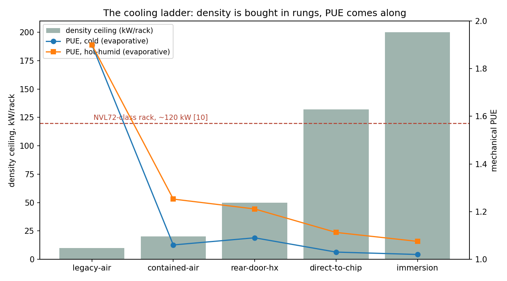
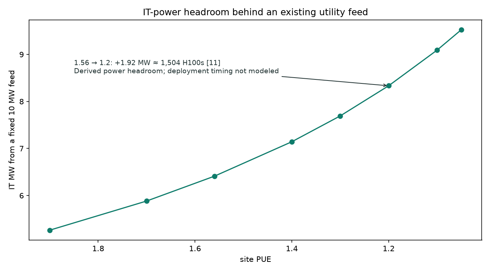
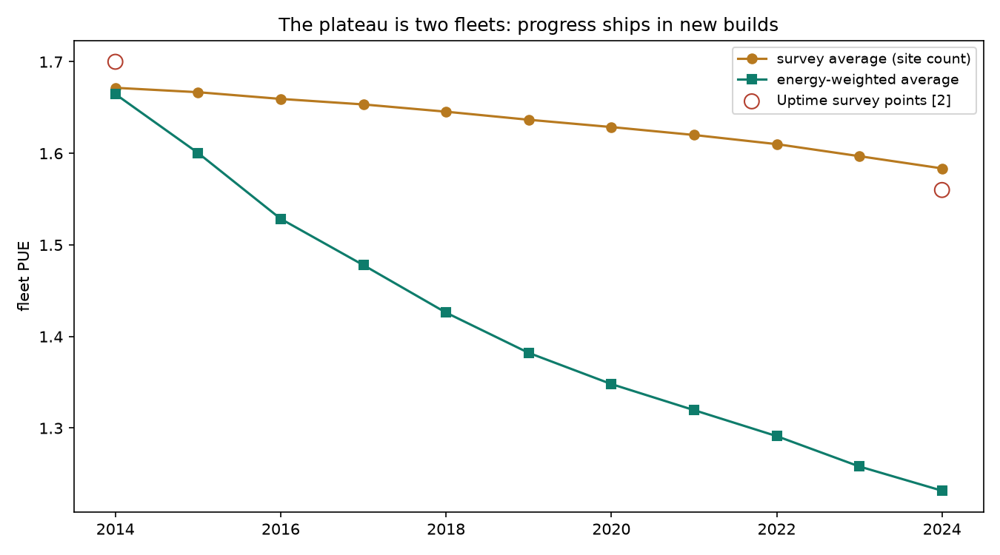

# cooling-pue-ladder: heat out, priced in PUE, megawatts, and seconds

**Cooling decides three things at once for an AI site: whether the rack
can exist (density), how much of the feed reaches the GPUs (PUE), and how
many seconds you survive a cooling fault (ride-through).** This repository
makes the cooling ladder executable — five rungs from legacy air to
immersion, a density gate you can put in CI, a capacity model where a PUE
point converts to megawatts, and an executable explanation — checked
against both public series — of why the industry-average PUE "plateau"
and hyperscale ~1.1 fleets [2][3] are both true at once.

**TL;DR:** run `pue-ladder validate` and six findings fall out.
**(1) Density, not efficiency, forces the ladder** — an NVL72-class
~120 kW rack [10] leaves only direct-to-chip and immersion standing; the
rear-door rung buys 2.5× density while cold-climate PUE gets slightly
*worse*. **(2) A PUE point is unqueued megawatts** — a 10 MW feed moved
from the survey-average 1.56 [2] to 1.2 frees ~1.9 MW (~1,500 H100s'
worth [11]) behind an interconnection you already own, against a median
~5-year queue for new grid capacity [8]. **(3) The plateau is two
fleets** — one adoption mechanism reproduces the 2014 (~1.7) and 2024
(~1.56) survey levels and the hyperscale ~1.1 fleets at once;
energy-weighted PUE runs ~0.31-0.36 below the survey number (mean 0.33
over 24 seeds), so ask
buyers' questions in energy-weighted terms. **(4) Efficiency sells ride-through** — the direct-to-chip rung AI
needs today is the ladder's thermal-buffer *minimum* (~11 s at 132 kW),
making cooling-loss a first-class chaos-testing fault. **(5) Water is a
priced axis** — evaporative assist buys PUE at ~1 L/kWh-class WUE [3];
dry rejection gives the water back for a modeled +0.015-0.08 PUE
(+0.02-0.03 on direct-to-chip). **(6) Ride-through and headroom are
admission fields** — at one density two rungs that both cool it give
opposite answers to a job needing 30 s of buffer, and two halls sharing a
feeder turn an admissible start into a *stagger*: the load fits, the
transition does not.

*Part of the DIMAGGI series on turning GPU capital into usable compute —
cooling sits upstream of `nominal` in `usable = nominal × network ×
scheduling × recovery × placement`: at a fixed grid feed, nominal IT
power is feed / PUE. Full analysis in [docs/study.md](docs/study.md);
all claims trace to [REFERENCES.md](REFERENCES.md).*

---

## The ladder



## A PUE point is unqueued megawatts



## The plateau is two fleets



## Quickstart

```
pip install cooling-pue-ladder                # or: pip install -e .
pue-ladder ladder                             # the rungs, priced
pue-ladder gate --density 120 --rung contained-air   # exit 1: BLOCKED
pue-ladder capacity --feed-mw 10 --pue-from 1.56 --pue-to 1.2
pue-ladder fleet                              # the two-fleets demo
pue-ladder admit --density 132 --need-ride-through 30   # who may start now
pue-ladder validate                           # model vs public record
```

`gate` exits non-zero when the rung can't cool the density — usable as a
CI gate for infrastructure-as-code. `admit` asks the narrower question a
control plane asks at job start: ride-through and hall headroom are
properties of the destination and cannot be sequenced away; only a shared
feeder's step limit can, and that one is a stagger rather than a refusal.
It exits non-zero when no rung admits the start as submitted. Every constant (density ceilings, PUE
floors and penalties, retrofit $/kW, thermal buffers) is an exposed field
on `cooling.ladder.RUNGS`, deliberately easy to override and rerun.

## Reproduce

```
make test        # 69 tests: invariants + the 14-point validation registry
make figures     # regenerates figures/ (needs matplotlib)
```

Python 3.10+, stdlib only; `matplotlib` only for figures. The validation
registry separates *calibrated* points (published fleet PUEs and the 2014
initial condition the constants were tuned to [2-6][13]) from *emergent*
ones (the held-out 2024 survey level and the survey/energy-weighted
divergence [2][7]) and *sanity* points (the density verdicts, which are
the ladder's own structure computed for a published rack spec, so they
cite nothing). It prints a DECLINED list of what it does NOT check, and
the test suite breaks the model on purpose — freezing the fleet, starting
it modern, collapsing the two averages, drifting a rung constant,
replacing the PUE model outright, raising every density ceiling — and
requires named points to go red, against a control proving the unmutated
registry is green. Two of those controls changed published numbers rather
than confirming them (see `docs/study.md`): the held-out 2024 band used
to admit a fleet that never modernized on 19 of 24 seeds.

## Series — turning GPU capital into usable compute

- **GPU Cluster Networking** ([network-vs-more-gpus](https://github.com/dimaggi-ai/network-vs-more-gpus)) · **GPU Cluster Scheduling** ([scheduler-vs-more-gpus](https://github.com/dimaggi-ai/scheduler-vs-more-gpus))
- **Chaos Fidelity Standard** ([ai-cluster-chaos-fidelity](https://github.com/dimaggi-ai/ai-cluster-chaos-fidelity)) · **Reliability Economics** ([reliability-economics](https://github.com/dimaggi-ai/reliability-economics)) · **Governed Autonomy** ([governed-autonomy](https://github.com/dimaggi-ai/governed-autonomy))
- **Compute↔Power Placement** ([compute-power-placement](https://github.com/dimaggi-ai/compute-power-placement)) · **Edge↔Neocloud Placement** ([edge-continuum-placement](https://github.com/dimaggi-ai/edge-continuum-placement)) · **AI-RAN ↔ Neocloud Resiliency** ([airan-neocloud-resiliency](https://github.com/dimaggi-ai/airan-neocloud-resiliency))
- **Cooling & the PUE Ladder** (this work) — heat out: the factor that converts a grid feed into nominal IT power

---

*Margaret (Maggie) Nanyonga — Founder & Principal Architect,
[DIMAGGI AI](https://dimaggi.ai).*
